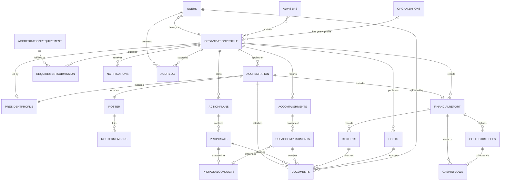

# Database Refactor Report — CnscCodexMain

**Scope analyzed:** `server/src/models/*.js`, `server/src/controller/*.js`, `server/src/middleware/*.js`, `server/src/routers.js`, `server/src/server.js`.
**Engine in use:** MongoDB via Mongoose (no SQL/relational layer exists in this repo — all "tables" below are Mongo collections referenced with `ObjectId`s, which is why this report treats normalization in document-database terms while still applying relational discipline).
**Unclear/unverifiable items** are explicitly flagged as such — I did not assume anything not visible in code.

---

## 1. Current Schema Analysis

### 1.1 Collections found (from `server/src/models/index.js` registrations)

| #   | Model var                  | Mongo collection (model name) | Source file                                               |
| --- | -------------------------- | ----------------------------- | --------------------------------------------------------- |
| 1   | `User`                     | `Users`                       | `users.js`                                                |
| 2   | `Adviser`                  | `Advisers`                    | `users.js`                                                |
| 3   | `Logs`                     | `Logs`                        | `users.js`                                                |
| 4   | `Organization`             | `Organizations`               | `organization.js`                                         |
| 5   | `OrganizationProfile`      | `OrganizationProfile`         | `organization.js`                                         |
| 6   | `PresidentProfile`         | `PresidentProfile`            | `president_profile.js`                                    |
| 7   | `Accreditation`            | `Accreditations`              | `accreditation.js`                                        |
| 8   | `AccreditationRequirement` | `AccreditationRequirement`    | `accreditation_requirement.js`                            |
| 9   | `RequirementSubmission`    | `RequirementSubmission`       | `requirement_submission.js`                               |
| 10  | `Roster`                   | `Roster`                      | `roster.js`                                               |
| 11  | `RosterMember`             | `RosterMembers`               | `roster.js`                                               |
| 12  | `Document`                 | `Documents`                   | `document.js`                                             |
| 13  | `Proposal`                 | `Proposals`                   | `proposals.js` (individual action-plan items)             |
| 14  | `ProposedActionPlan`       | `ProposedActionPlan`          | `proposals.js` (per-org/year container of Proposals)      |
| 15  | `ProposalConduct`          | `ProposalsConduct`            | `proposals.js` (execution/"conduct" record of a proposal) |
| 16  | `Accomplishment`           | `Accomplishments`             | `accomplishment.js`                                       |
| 17  | `SubAccomplishment`        | `SubAccomplishment`           | `accomplishment.js`                                       |
| 18  | `Receipt`                  | `Receipts`                    | `financial_report.js`                                     |
| 19  | `collectibleFee`           | `CollectibleFee`              | `financial_report.js`                                     |
| 20  | `cashInflows`              | `CashInflow`                  | `financial_report.js`                                     |
| 21  | `FinancialReport`          | `FinancialReport`             | `financial_report.js`                                     |
| 22  | `Post`                     | `Posts`                       | `post.js`                                                 |
| 23  | `Notification`             | `Notification`                | `notification.js`                                         |
| 24  | `AuditLog`                 | `AuditLog`                    | `audit_log.js`                                            |
| 25  | `RoomLocation`             | `RoomLocation`                | `room_location.js`                                        |

25 collections total. `DeadlineSchema` is defined in `users.js` but **never compiled into a model or imported in `index.js`** — dead/unused schema (confirmed by `grep` — no `mongoose.model("Deadline"...)` anywhere).

### 1.2 Current relationships (as coded today)

- `Organization` 1—N `OrganizationProfile` (array `organization.organizationProfile[]`, _and_ each profile back-references `organization` — bidirectional array+FK).
- `OrganizationProfile` 1—1 `PresidentProfile` (`orgPresident`), 1—1 `Adviser` (`adviser`, but `Adviser.organizationProfile` is itself an **array**, implying an adviser can serve N profiles — inconsistent cardinality between the two sides).
- `OrganizationProfile` 1—1 `Accreditation` per active cycle (looked up via `findOne({organizationProfile, isActive:true})`, not an actual unique DB constraint).
- `Accreditation` 1—1 `FinancialReport`, 1—1 `Roster`, 1—1 `PresidentProfile`, 1—1..3 `Document` (Joint Statement, Pledge Against Hazing, Constitution/By-laws) — all stored as forward-only ObjectId fields on `Accreditation`.
- `Roster` 1—N `RosterMember` (`rosterMembersSchema.roster` FK — correctly modeled this one way).
- `FinancialReport` 1—N `Receipt` / `CollectibleFee` / `CashInflow`, but modeled as **arrays of ObjectIds on the parent** (`collections[]`, `cashoutflows[]`, `reimbursements[]`, `disbursements[]`, `collectibleFees[]`, `cashInflows[]`) — the child documents themselves carry no back-reference to `FinancialReport`.
- `ProposedActionPlan` 1—N `Proposal` (array `ProposedIndividualActionPlan[]` on parent, **and** `Proposal.ProposedActionPlanSchema` back-FK on the child — redundant bidirectional linkage).
- `Proposal` (the action-plan item) eventually becomes a `ProposalConduct` (execution record) — but `proposalConductSchema` re-embeds a **denormalized snapshot** of the proposal's fields (`ProposedIndividualActionPlan: { activityTitle, alignedSDG, budgetaryRequirements, venue, briefDetails, AlignedObjective, proposedDate, Proponents }`) instead of just referencing `Proposal`.
- `Accomplishment` 1—N `SubAccomplishment` via an array on the parent (`accomplishments[]`); `SubAccomplishment` has **no back-reference** to its parent `Accomplishment`.
- `Document` is a generic polymorphic attachment referenced from: `Accreditation`, `Post.content[]`, `Receipt.document`, `accreditation_requirement.document`, `requirement_submission.document`, `subAccomplishmentSchema.documents[]`, `proposals.document[]`. It is **not** itself typed by "which feature owns it" beyond `organization`/`organizationProfile`.
- `User`/`Adviser`/`Logs` all duplicate the same `organizationProfile` + `Organization` reference pattern independently (no shared base schema).
- `AuditLog` references `actorId → Users`, `organizationProfile → OrganizationProfile`, generic `targetType` (string) + `targetId` (untyped `ObjectId`) — a manual polymorphic reference with no enum/validation on `targetType`.

### 1.3 Current weaknesses (summary — details and severities in §2)

- No relational integrity enforcement (no `unique` constraints on natural keys like email/username/student ID; no foreign-key validation at the DB layer, which is normal for Mongo but is _not compensated for_ anywhere in application code via transactions).
- Two parallel, duplicated context keys (`organization` **and** `organizationProfile`) carried on nearly every collection, with **inconsistent and in places literally broken `ref` strings** (see Finding 1).
- Several 1:N relationships modeled as **unbounded arrays of ObjectIds on the "one" side** instead of a foreign key on the "many" side — the classic Mongo anti-pattern that breaks down at scale (16MB document cap, non-atomic dual writes, no independent indexing of children).
- Almost no indexes declared anywhere except `AuditLog`, `AccreditationRequirement`, `RequirementSubmission`, and `RoomLocation`. Every other collection — including the busiest filter field in the whole app, `organizationProfile` — has **zero indexes**.
- Passwords stored and compared in **plaintext**.
- No pagination on the vast majority of list endpoints.
- N+1 query patterns inside loops in several controllers.

---

## 2. Problems Found

Each issue below cites the exact file/field where it was observed.

### 2.1 Data modeling / normalization issues

| #   | Issue                                                                                                                                                                                                                                                                                                                                                                                                                                                                                                                                                                                                                                                                                                                                                    | Where                                                                                          | Severity                                                                                                                                                                                                                                              |
| --- | -------------------------------------------------------------------------------------------------------------------------------------------------------------------------------------------------------------------------------------------------------------------------------------------------------------------------------------------------------------------------------------------------------------------------------------------------------------------------------------------------------------------------------------------------------------------------------------------------------------------------------------------------------------------------------------------------------------------------------------------------------- | ---------------------------------------------------------------------------------------------- | ----------------------------------------------------------------------------------------------------------------------------------------------------------------------------------------------------------------------------------------------------- |
| 1   | **Broken/inconsistent `ref` strings for the same logical relationship.** The `Organization` model is registered as `"Organizations"`, but schemas reference it inconsistently: `document.js` uses `ref: "organization"` (lowercase, not a registered model name), `roster.js` uses `ref: "organization"` (lowercase), `president_profile.js` uses `ref: "Organization"` (singular), `accomplishment.js` uses `ref: "Organization"` (singular), while `proposals.js`'s `proposalConductSchema`/`ProposedActionPlanSchema` correctly use `ref: "Organizations"`. Similarly `financial_report.js`'s `financialReportSchema.accreditation` uses `ref: "accreditations"` (lowercase) against a model registered as `"Accreditations"`.                        | `document.js`, `roster.js`, `president_profile.js`, `accomplishment.js`, `financial_report.js` | **High** — any `.populate("organization")`/`.populate("accreditation")` on these paths will either silently return `null` or throw `MissingSchemaError` depending on Mongoose version/strict mode. This is a live, reproducible bug, not a style nit. |
| 2   | **Dual redundant context keys (`organization` + `organizationProfile`) on nearly every collection** (`Document`, `Roster`, `Accomplishment`, `SubAccomplishment`, `PresidentProfile`, `Proposal`, `ProposalConduct`, `ProposedActionPlan`, `User`, `Adviser`, `Logs`). `OrganizationProfile` already has `organization` as its own FK, so any document that stores `organizationProfile` can derive `organization` via a single hop — storing both is denormalization with no documented justification, and nothing in the codebase keeps the two in sync transactionally (e.g., `registration.js` `UpdateUser` lets a caller change `organizationProfile` and `organization` independently in the same call with no cross-check that they still agree). | Across nearly all models                                                                       | **High** — silent data drift risk; two sources of truth for the same fact.                                                                                                                                                                            |
| 3   | **1:N relationships modeled as arrays-of-ObjectId on the parent instead of FK on the child**, with no back-reference at all: `FinancialReport.collections/collectibleFees/cashInflows/cashoutflows/reimbursements/disbursements`, `Accomplishment.accomplishments[]` (children `SubAccomplishment` carry no `accomplishment` field), `ProposedActionPlan.ProposedIndividualActionPlan[]` (this one _also_ keeps a redundant back-FK on `Proposal.ProposedActionPlanSchema`, so it's inconsistent even within itself).                                                                                                                                                                                                                                    | `financial_report.js`, `accomplishment.js`, `proposals.js`                                     | **High** — breaks at scale (see §2.3), and for `SubAccomplishment`/financial children, there is **no way to find the parent from the child** without a reverse `$elemMatch` scan across the whole parent collection.                                  |
| 4   | **Confusing naming collisions.** A field named `ProposedActionPlanSchema` (referencing model `ProposedActionPlan`) appears as a _field name_ inside `proposedIndividualActionPlanSchema` and `proposalConductSchema` — the field is named after a _Schema_, not after what it represents (it should be `proposedActionPlan` or `actionPlanId`). The model `proposalConductSchema` also embeds a field literally named `ProposedIndividualActionPlan` (an object) which is a different _shape_ than the `Proposal`/`proposedIndividualActionPlanSchema` model it's named after — two different things share almost the same name in two different files.                                                                                                  | `proposals.js`                                                                                 | **Medium** — pure maintainability/readability risk, but high blast radius because new engineers will misread which entity is which.                                                                                                                   |
| 5   | **Snapshot duplication instead of referencing.** `proposalConductSchema.ProposedIndividualActionPlan` re-embeds `activityTitle, alignedSDG, budgetaryRequirements, venue, briefDetails, AlignedObjective, proposedDate, Proponents` — all fields that already exist on `Proposal`. If this is intentional point-in-time snapshotting (plausible, since a conduct record should reflect what was approved, not live-edited later), it is **undocumented** in code — no comment explains the intent, and there's no versioning/snapshot timestamp field to prove it's a deliberate snapshot vs. accidental copy-paste duplication.                                                                                                                         | `proposals.js`                                                                                 | **Medium** (would be **Low** if the snapshot intent were explicit and versioned)                                                                                                                                                                      |
| 6   | **Inconsistent casing/naming conventions** across fields: `PascalCase` fields mixed with `camelCase` in the same schema (e.g., `proposalConductSchema`: `ProposedActionPlanSchema`, `ProposedIndividualActionPlan`, `overallStatus`, `revision`, `organizationProfile` — capitalized type-like names next to lowercase business fields). Also `Object`/`Array` used as bare Mongoose types (`talentSkills: [Object]`, `alignedSDG: Array`) instead of explicit sub-schemas, which provides **zero schema validation** for nested data shape.                                                                                                                                                                                                             | `proposals.js`, `president_profile.js`                                                         | **Medium**                                                                                                                                                                                                                                            |
| 7   | **No unique constraint on natural keys.** `User.email`, `User.username`, `RosterMember.studentId`, `RosterMember.email`, `Organization.currentName`, `OrganizationProfile.orgAcronym` are all plain `String` with no `unique: true` and no index. `registration.js`'s `PostUser` does a `findOne({email})` check-then-insert with **no unique index backing it** — a classic **TOCTOU race condition**: two concurrent signups with the same email can both pass the "doesn't exist" check before either write completes, producing duplicate user accounts with the same email.                                                                                                                                                                         | `users.js`, `roster.js`, `registration.js:80-101`                                              | **High**                                                                                                                                                                                                                                              |
| 8   | **Polymorphic `AuditLog.targetType`/`targetId` with no enum or discriminator.** `targetType` is a free-text `String` (comment lists example values: `'ProposalConduct'`, `'Roster'`, `'PresidentProfile'`) with no `enum` validation, so any typo silently produces an unqueryable orphan category.                                                                                                                                                                                                                                                                                                                                                                                                                                                      | `audit_log.js`                                                                                 | **Low**                                                                                                                                                                                                                                               |
| 9   | **`Document` model is too thin for its job.** It only stores `organization`, `organizationProfile`, `label`, `fileName`, `revisionNotes`, `isPinned`, `logs[]`, `status`. There is **no MIME type, no file size, no storage path/URL, no checksum, and no `uploadedBy`** field, even though `middleware/files.js` writes files to local disk under `../public/<organizationId>/<filename>` and a separate `../archive/<organizationId>/` tree on delete. Reconstructing a file's real location requires re-deriving the disk path convention in every controller rather than storing it once.                                                                                                                                                            | `document.js`, `middleware/files.js`                                                           | **High** for production readiness (no audit trail of who uploaded what, no validation of file type/size at the DB layer, can't migrate to S3/Blob storage without a path field to begin with).                                                        |
| 10  | **Disk-coupled file storage with no DB-recorded path.** Files live on local disk (`multer.diskStorage`), which does not scale horizontally (multiple app instances/containers would each have their own disk) and isn't reflected anywhere in `Document`.                                                                                                                                                                                                                                                                                                                                                                                                                                                                                                | `middleware/files.js`                                                                          | **High** (operational/scalability, adjacent to schema problem #9)                                                                                                                                                                                     |
| 11  | **Adviser↔OrganizationProfile cardinality mismatch.** `OrganizationProfile.adviser` is a single `ObjectId` (1 adviser per profile), but `Adviser.organizationProfile` is an **array** (implying 1 adviser can serve many profiles) — both sides exist and are never reconciled by any sync logic found in the controllers reviewed. This is an N:N relationship trying to be expressed as one side being a scalar and the other an array, which is internally inconsistent.                                                                                                                                                                                                                                                                              | `organization.js`, `users.js`                                                                  | **Medium**                                                                                                                                                                                                                                            |

### 2.2 Indexing issues

| # | Issue | Severity |
|---|---|---|
| 12 | **`organizationProfile` — the single most-queried filter field in the entire system** (used as the primary tenant/scope filter in `Document`, `Roster`, `RosterMember`'s parent, `Accreditation`, `FinancialReport`, `Accomplishment`, `Proposal`, `ProposalConduct`, `Post`, `Notification`, `PresidentProfile`, `User`, `Adviser`, `AuditLog`) has **no index on any of these collections except `RequirementSubmission` and `AuditLog`.** Every `.find({organizationProfile: ...})` across `accreditation-document.js`, `financial-report.js`, `accomplishments.js`, `proposal-conduct.js`, `notification.js`, etc. is doing a full collection scan once data volume grows. | **High** |
| 13 | **No index on `status`/`overallStatus`/`overAllStatus` fields**, despite dashboards (`generate-reports.js`, `RQAT.js`) repeatedly filtering on these (`overallStatus: "Conduct Approved"`, `isActive: true`, etc.) in combination with `organizationProfile`. | **High** |
| 14 | **No compound indexes** for the actual access patterns used in code, e.g. `ProposalConduct.find({organizationProfile, overallStatus, isActive})` (`RQAT.js:28-32`) would benefit from a compound `{organizationProfile:1, isActive:1, overallStatus:1}` index, but none exists. | **High** |
| 15 | **Unescaped, unanchored `$regex` searches with no text index**, used for "search" features across `organization.js` and `registration.js` (`orgName`, `orgAcronym`, `orgClass`, `orgCourse`, `orgDepartment`, `adviserName`, `originalName`, `currentName`, `email`). These (a) force full collection scans, and (b) interpolate raw user input directly into `new RegExp(...)` with **no escaping of regex metacharacters** — a user-supplied value like `(a+)+$` is a regex-denial-of-service (ReDoS) vector, and at minimum a malformed search string can throw an uncaught `SyntaxError` in `RegExp` construction. | `organization.js:213-218,282-287,326-327,394`, `registration.js:295-341,567` | **High** (functional/perf) + flagged as a security input-validation gap |
| 16 | **No unique index enforcing one active `Accreditation` per `organizationProfile`.** The "only one active accreditation cycle" invariant is enforced only by *application logic* (`findOne({organizationProfile, isActive:true})`), not by the database, so a bug or race condition could create two active accreditations for the same org. | `accreditation.js`, `accreditation-document.js` | **Medium** |
 

### 2.3 Scalability / query-pattern issues

| #   | Issue                                                                                                                                                                                                                                                                                                                                                                                                                                                                                                                                                                                                                                                        | Where                                                                                                                                                    | Severity                                     |
| --- | ------------------------------------------------------------------------------------------------------------------------------------------------------------------------------------------------------------------------------------------------------------------------------------------------------------------------------------------------------------------------------------------------------------------------------------------------------------------------------------------------------------------------------------------------------------------------------------------------------------------------------------------------------------ | -------------------------------------------------------------------------------------------------------------------------------------------------------- | -------------------------------------------- |
| 17  | **N+1 query pattern.** `getOrganizationSummary` populates all organizations, then **inside a `for` loop over every organization** issues a separate `ProposalConduct.find({organizationProfile: profile._id, ...})` query per organization. With 100k+ orgs this is 100k+ round-trips for one report endpoint.                                                                                                                                                                                                                                                                                                                                               | `RQAT.js:23-33`                                                                                                                                          | **High**                                     |
| 18  | Similar per-iteration query/processing loops appear in `financial-report.js` (`for (const report of reports) { for (const fee of report.collectibleFees) ... }` — nested loop over a populated array, itself evidence of the array-on-parent anti-pattern from Finding 3), `notification.js` (`for (const profile of activeOrgProfiles)` twice), `organization.js` (`for (const user of users)`), `accomplishments.js`, `proposal-conduct.js`, `general.js`.                                                                                                                                                                                                 | `financial-report.js:225,250`, `notification.js:26,180`, `organization.js:128`, `accomplishments.js:245,590`, `proposal-conduct.js:41`, `general.js:216` | **Medium–High** depending on collection size |
| 19  | **No pagination anywhere except `audit-logs.js`.** Every other "list" endpoint (`Organization.find()`, `GetAccreditationDocumentsAll`, `getOrganizationSummary`, financial report listings, accomplishment listings) returns the **entire collection** in one response. At 100k+ orgs/users this is an unbounded payload and unbounded memory/CPU spike per request.                                                                                                                                                                                                                                                                                         | `RQAT.js`, `accreditation-document.js`, `organization.js`, `financial-report.js`, etc.                                                                   | **High**                                     |
| 20  | **Over-fetching via deep, wide `.populate()` chains with `.lean()` used only 9 times across ~90 populate call sites.** Hydrating full Mongoose documents (with getters/setters/virtuals) for read-only report endpoints (`generate-reports.js`, `RQAT.js`, `accreditation-document.js`) wastes CPU/memory at scale; `.select()` is used in only 21 of ~90+ query sites, meaning most queries pull entire documents (including large embedded arrays/objects like `gradingHistory`, `talentSkills`, `presentAddress`) even when only 1–2 fields are needed by the caller.                                                                                     | Across controllers                                                                                                                                       | **Medium**                                   |
| 21  | **Unbounded embedded/array growth.** `FinancialReport.collections/cashoutflows/reimbursements/disbursements` arrays grow once per transaction recorded, indefinitely, for the lifetime of an organization — combined with Finding 3 (no child→parent FK), the only way to bound this is to never let an org operate for "too long," which is not a real constraint. Same risk applies to `Accomplishment.accomplishments[]` and `gradingHistory[]` (an array of full grading snapshots nested _inside_ every `SubAccomplishment`, also unbounded over the document's lifetime) and `AdviserSchema.organizationProfile[]`/`LogsSchema.organizationProfile[]`. | `financial_report.js`, `accomplishment.js`, `users.js`                                                                                                   | **Medium–High**                              |
| 22  | **No DB-level transactions anywhere in the codebase** (`grep` for `startTransaction`/`withTransaction`/`session` against Mongoose sessions returns **zero hits** in `server/src/controller`). Combined with the array-push-on-parent pattern (Finding 3) and multi-step writes like `organization.js`'s `PostStatusUpdateOrganization` (update org → create notification → loop-send emails, with no rollback if a later step fails), partial failures leave the database in an inconsistent state with no compensating logic.                                                                                                                               | All controllers                                                                                                                                          | **High**                                     |

### 2.4 Security / integrity issues found incidentally during the scan

| #   | Issue                                                                                                                                                                                                                                                                                                                                                                                                                                                       | Where                           | Severity                                                                                                                                                                                                                                                                                                                                   |
| --- | ----------------------------------------------------------------------------------------------------------------------------------------------------------------------------------------------------------------------------------------------------------------------------------------------------------------------------------------------------------------------------------------------------------------------------------------------------------- | ------------------------------- | ------------------------------------------------------------------------------------------------------------------------------------------------------------------------------------------------------------------------------------------------------------------------------------------------------------------------------------------ |
| 23  | **Passwords stored and compared in plaintext.** `registration.js:99` stores `password: userPassword` with the comment `// ⚠️ hash later with bcrypt` (never implemented); `general.js:294` authenticates with `user.password?.trim() !== password?.trim()` — a direct plaintext string comparison, not even constant-time. A second password-reset code path at `registration.js:234` has a **commented-out** `bcrypt.hash` call that was never re-enabled. | `registration.js`, `general.js` | **High** (flagging because it is a direct database-design/data-at-rest concern, not just an app-logic concern — the `password` field's `type: String, minlength: 6` in `users.js` has no `select: false`, so it is returned by default on every `User.find()` unless a controller remembers to `.select("-password")`, which most do not). |
| 24  | **Mongo connection string and app behavior depend on `MONGO_URI`/session secret env vars with no pool-size, write-concern, or read-preference tuning** in `mongoose.connect(DB)` — fine for current load, but worth deciding deliberately before scaling.                                                                                                                                                                                                   | `server.js:25-32`               | **Low** (operational, flagged for completeness)                                                                                                                                                                                                                                                                                            |

---

## 3. Proposed New Schema

Design principles applied:

1. **One canonical tenant key.** Drop the redundant `organization` field everywhere `organizationProfile` is already present; derive `organization` via a single populate/join when needed. Keep `organization` only on documents that have no `organizationProfile` (none currently — `OrganizationProfile` is itself the single per-year tenant root).
2. **Foreign key lives on the "many" side, always.** Every 1:N relationship is re-modeled as a FK on the child, indexed. Parent-side arrays of ObjectIds are removed entirely (the parent can always query `Child.find({parentId})` using the new index — this is the standard Mongo fix for unbounded-array growth).
3. **Fix all `ref` strings** to match actual registered model names exactly, and standardize on the _plural, PascalCase_ convention already used for the majority (`Organizations`, `Accreditations`, etc.) — pick one convention and apply it everywhere.
4. **Add `unique` + compound indexes** on every natural key and every hot filter combination found in the controllers.
5. **Promote `Document` to a real attachment record** with `storageKey`, `mimeType`, `sizeBytes`, `checksum`, `uploadedBy`, `ownerType`/`ownerId` (polymorphic but `enum`-constrained).
6. **Resolve naming collisions**: rename the `ProposedActionPlanSchema`-as-a-field to `actionPlanRef`; rename the embedded snapshot in `ProposalConduct` to `proposalSnapshot` with an explicit `snapshotAt` timestamp, making the intentional-snapshot design explicit instead of ambiguous.
7. **Constrain polymorphic fields** (`AuditLog.targetType`) with `enum`.

### 3.1 New/changed collections

```
Users                 (unique: email, username)
Advisers              (unique: email)
Organizations
OrganizationProfiles  (unique: organization+academicYear OR orgAcronym+academicYear)
PresidentProfiles
Accreditations        (unique: organizationProfile+isActive partial index)
AccreditationRequirements
RequirementSubmissions
Rosters
RosterMembers         (FK: roster, indexed; unique: roster+studentId)
Documents             (now carries storageKey/mimeType/size/checksum/uploadedBy/ownerType/ownerId)
ActionPlans           (renamed from ProposedActionPlan; no child array)
Proposals             (FK: actionPlan, indexed; back-ref only, no parent array)
ProposalConducts      (FK: proposal, indexed; proposalSnapshot{...} + snapshotAt)
Accomplishments
SubAccomplishments    (FK: accomplishment, indexed — NEW field, closes Finding 3/21)
FinancialReports
Receipts              (FK: financialReport, indexed — NEW field)
CollectibleFees       (FK: financialReport, indexed — NEW field)
CashInflows           (FK: financialReport + collectibleFee, indexed)
Posts
Notifications
AuditLogs
RoomLocations
```

### 3.2 Key schema definitions (illustrative, Mongoose-style)

```js
// Users — unique natural keys + lean security posture
{
  name: String,
  email: { type: String, required: true, unique: true, lowercase: true, trim: true },
  username: { type: String, required: true, unique: true, trim: true },
  passwordHash: { type: String, required: true, select: false }, // never returned by default
  position: { type: String, enum: ["student-leader","adviser","dean","sdu-coordinator","admin"], required: true },
  deliveryUnit: String,
  organizationProfile: { type: ObjectId, ref: "OrganizationProfile", index: true },
  firstLogin: { type: Boolean, default: true },
}
// index: { email: 1 } unique, { username: 1 } unique, { organizationProfile: 1 }
```

```js
// OrganizationProfile — single canonical tenant root for a given academic year
{
  organization: { type: ObjectId, ref: "Organizations", required: true, index: true },
  orgPresident: { type: ObjectId, ref: "PresidentProfile" },
  adviser: { type: ObjectId, ref: "Advisers", index: true },
  academicYear: { type: String, required: true }, // e.g. "2025-2026" — was implicit/missing; now explicit
  orgName: String, orgAcronym: { type: String, index: true },
  orgClass: String, orgCourse: String, orgDepartment: { type: String, index: true },
  orgStatus: { type: String, enum: ["Active","Inactive","Disqualified"], default: "Active" },
  overAllStatus: { type: String, enum: ["Pending","Approved","Disapproved","RevisionRequested"], default: "Pending", index: true },
  isActive: { type: Boolean, default: true },
}
// index: { organization: 1, academicYear: 1 } unique  -- one profile per org per year
// index: { overAllStatus: 1, isActive: 1 }
// text index: { orgName: "text", orgAcronym: "text", orgDepartment: "text" }  -- replaces unanchored $regex scans
```

```js
// Documents — promoted to a real attachment record
{
  organizationProfile: { type: ObjectId, ref: "OrganizationProfile", required: true, index: true },
  ownerType: { type: String, enum: ["Accreditation","Receipt","Post","Proposal","RequirementSubmission","SubAccomplishment"], required: true },
  ownerId: { type: ObjectId, required: true },
  label: String,
  fileName: { type: String, required: true },
  storageKey: { type: String, required: true }, // disk path or S3/Blob key — single source of truth
  mimeType: String,
  sizeBytes: Number,
  checksum: String,
  uploadedBy: { type: ObjectId, ref: "Users", index: true },
  status: { type: String, enum: ["Pending","Approved","RevisionRequested","Rejected"], default: "Pending", index: true },
  isPinned: { type: Boolean, default: false },
  revisionNotes: String,
}
// index: { ownerType: 1, ownerId: 1 }
// index: { organizationProfile: 1, status: 1 }
```

```js
// SubAccomplishment — NEW back-reference closes the orphan-child problem
{
  accomplishment: { type: ObjectId, ref: "Accomplishments", required: true, index: true }, // NEW
  organizationProfile: { type: ObjectId, ref: "OrganizationProfile", required: true, index: true },
  category: { type: String, required: true },
  title: String, description: String, date: Date,
  proposal: { type: ObjectId, ref: "ProposalConducts" },
  documents: [{ type: ObjectId, ref: "Documents" }], // small, bounded list of attachment refs — acceptable array use
  grading: { totalPoints: Number, maxPoints: Number, breakdown: Schema.Types.Mixed, comments: String,
             status: { type: String, enum: ["Pending","Graded","Reset"], default: "Pending" }, gradedAt: Date, gradedBy: { type: ObjectId, ref: "Users" } },
  awardedPoints: { type: Number, default: 0 },
}
// gradingHistory is moved OUT of the document into its own bounded collection: GradingHistory{subAccomplishment, snapshotAt, ...}
// index: { accomplishment: 1 }, { organizationProfile: 1, category: 1 }
```

```js
// Receipts / CollectibleFees / CashInflows — FK now lives on the child, closing Finding 3/21
{
  financialReport: { type: ObjectId, ref: "FinancialReport", required: true, index: true }, // NEW
  organizationProfile: { type: ObjectId, ref: "OrganizationProfile", required: true, index: true },
  description: String, amount: { type: Number, required: true, min: 0 },
  expenseType: String,
  document: { type: ObjectId, ref: "Documents" },
  date: { type: Date, default: Date.now, index: true },
}
// FinancialReport no longer stores collections[]/cashoutflows[]/etc — they're queried as
// Receipt.find({financialReport, kind:"inflow"|"outflow"|"reimbursement"|"disbursement"})
// (kind replaces having 4 separate array buckets that were all really "a typed Receipt")
```

```js
// Proposals / ActionPlans / ProposalConducts — single direction of reference, explicit snapshot
{
  // ActionPlan (was ProposedActionPlan): parent container, NO array of children
  organizationProfile: { type: ObjectId, ref: "OrganizationProfile", required: true, index: true },
  accreditation: { type: ObjectId, ref: "Accreditations", index: true },
  overallStatus: { type: String, enum: ["Pending","Approved","Disapproved"], default: "Pending" },
}
{
  // Proposal: back-ref only, query ActionPlan's children via Proposal.find({actionPlan})
  actionPlan: { type: ObjectId, ref: "ActionPlans", required: true, index: true }, // renamed from ProposedActionPlanSchema
  organizationProfile: { type: ObjectId, ref: "OrganizationProfile", required: true, index: true },
  activityTitle: { type: String, required: true },
  alignedSDG: [String],
  budgetaryRequirements: Number, venue: String, proposalType: String,
  proposalCategory: String, briefDetails: String, alignedObjective: String, proposedDate: Date,
  proponents: [{ type: ObjectId, ref: "OrganizationProfile" }],
  documents: [{ type: ObjectId, ref: "Documents" }],
}
{
  // ProposalConduct: references Proposal + an EXPLICIT, intentional point-in-time snapshot
  proposal: { type: ObjectId, ref: "Proposals", required: true, index: true },
  organizationProfile: { type: ObjectId, ref: "OrganizationProfile", required: true, index: true },
  overallStatus: { type: String, enum: ["Pending","Conduct Approved","Conduct Disapproved","RevisionRequested"], default: "Pending", index: true },
  proposalSnapshot: { activityTitle: String, alignedSDG: [String], budgetaryRequirements: Number, venue: String,
                       briefDetails: String, alignedObjective: String, proposedDate: Date, proponents: [ObjectId] },
  snapshotAt: { type: Date, required: true }, // makes "this is a deliberate frozen copy" explicit
  isActive: { type: Boolean, default: true },
}
```

### 3.3 Index strategy (full list)

| Collection          | Index                                                                  | Purpose                                                    |
| ------------------- | ---------------------------------------------------------------------- | ---------------------------------------------------------- |
| Users               | `{email:1}` unique, `{username:1}` unique                              | integrity + login lookup (closes Finding 7)                |
| Users               | `{organizationProfile:1}`                                              | scoping queries                                            |
| Advisers            | `{email:1}` unique, `{organizationProfile:1}`                          | integrity + scoping                                        |
| OrganizationProfile | `{organization:1, academicYear:1}` unique                              | one profile per org/year                                   |
| OrganizationProfile | `{overAllStatus:1, isActive:1}`                                        | dashboard/report filters                                   |
| OrganizationProfile | text `{orgName, orgAcronym, orgDepartment}`                            | replaces unsafe `$regex` scans (closes Finding 15)         |
| Accreditation       | `{organizationProfile:1, isActive:1}` unique partial (`isActive:true`) | enforce "one active cycle" at DB level (closes Finding 16) |
| RosterMember        | `{roster:1}`, `{roster:1, studentId:1}` unique                         | FK lookup + integrity                                      |
| Documents           | `{organizationProfile:1, status:1}`, `{ownerType:1, ownerId:1}`        | scoping + polymorphic owner lookup                         |
| Proposals           | `{actionPlan:1}`, `{organizationProfile:1}`                            | FK lookup, scoping                                         |
| ProposalConducts    | `{proposal:1}`, `{organizationProfile:1, overallStatus:1, isActive:1}` | closes the exact N+1 query in `RQAT.js`                    |
| Accomplishments     | `{organizationProfile:1, academicYear:1}`                              | scoping                                                    |
| SubAccomplishments  | `{accomplishment:1}`, `{organizationProfile:1, category:1}`            | FK lookup (closes Finding 3/21)                            |
| FinancialReport     | `{organizationProfile:1}`, `{accreditation:1}`                         | scoping                                                    |
| Receipts            | `{financialReport:1, kind:1, date:-1}`                                 | FK lookup + typed query (closes Finding 3)                 |
| CollectibleFees     | `{financialReport:1}`                                                  | FK lookup                                                  |
| CashInflows         | `{financialReport:1, collectibleFee:1}`                                | FK lookup                                                  |
| Posts               | `{organizationProfile:1, status:1, createdAt:-1}`                      | feed queries                                               |
| Notifications       | `{organizationProfile:1, read:1, createdAt:-1}`                        | unread-notification queries                                |
| AuditLog            | _(already indexed — keep as-is)_                                       | —                                                          |
| RoomLocation        | _(already indexed — keep as-is)_                                       | —                                                          |

---

## 4. Migration Plan

### 4.1 Step-by-step strategy

1. **Stand up the new fields alongside the old ones (additive phase).**
   - Add `storageKey`, `mimeType`, `sizeBytes`, `uploadedBy`, `ownerType`, `ownerId` to `Documents` as optional fields.
   - Add `accomplishment` to `SubAccomplishment`, `financialReport` to `Receipt`/`CollectibleFee`/`CashInflow`, `actionPlan` to `Proposal`, `proposal`+`snapshotAt` to `ProposalConduct` — all optional at first so existing writes don't break.
2. **Backfill script (one-time, idempotent, batched).**
   - For each `Accomplishment`, iterate its `accomplishments[]` array and `$set` the new `accomplishment` field on each referenced `SubAccomplishment` (batch in chunks of e.g. 1,000 using `bulkWrite`).
   - For each `FinancialReport`, iterate `collections/cashoutflows/reimbursements/disbursements[]` and `$set financialReport` (+ a new `kind` field reflecting which bucket it came from) on each referenced `Receipt`; same for `collectibleFees[]`→`CollectibleFee` and `cashInflows[]`→`CashInflow`.
   - For each `ProposedActionPlan`, iterate `ProposedIndividualActionPlan[]` and `$set actionPlan` on each `Proposal` (this likely already matches the existing `ProposedActionPlanSchema` back-ref — verify equality and log any mismatches found, since this is the perfect opportunity to detect existing drift caused by Finding 2/3).
   - For `Documents`, derive `storageKey` from the existing on-disk convention (`../public/<organization>/<fileName>`) since `organization` + `fileName` are already present on every legacy document; derive `mimeType` via `mime-types` lookup from `fileName`'s extension where not recoverable any other way; leave `sizeBytes`/`checksum` null where files can't be safely re-read (flag these for follow-up — do not block migration on this).
   - Fix all broken `ref` strings (Finding 1) in one PR with no data migration required — this is a code-only fix, but **must ship before** any new `.populate()` code relies on it.
3. **Add the new indexes** (`createIndex` in the background, `unique` indexes only after step 2's backfill is verified to contain zero duplicates — run a duplicate-detection aggregation first, e.g. `db.users.aggregate([{$group:{_id:"$email", count:{$sum:1}}},{$match:{count:{$gt:1}}}])`, and manually resolve any collisions before applying `unique:true`).
4. **Switch reads to the new pattern.** Update controllers to query children directly (`Receipt.find({financialReport})` instead of `.populate("collections")`), confirm output parity against the old array-based reads in a staging environment (diff the JSON responses for a sample of orgs).
5. **Switch writes to the new pattern.** New `Receipt`/`SubAccomplishment`/`Proposal` creation sets the new FK field directly; stop pushing to the old parent arrays.
6. **Deprecate (do not yet delete) the old array fields.** Mark them `// @deprecated` in schema comments, stop reading from them in application code, but leave the fields in the documents for one full release cycle as a safety net.
7. **Drop the redundant `organization` field** from collections where `organizationProfile` already exists, only after confirming (via an aggregation join) that `organizationProfile.organization` always agrees with the document's own `organization` field for 100% of records — any disagreement found here is a real data-integrity bug from Finding 2 and must be manually reconciled before the field is dropped.
8. **Final cleanup migration.** Remove the deprecated array fields (`collections`, `cashoutflows`, `reimbursements`, `disbursements`, `collectibleFees`, `cashInflows`, `accomplishments[]`, `ProposedIndividualActionPlan[]` on `ProposedActionPlan`) and the redundant `organization` fields via `$unset` in a final batched migration.
9. **Password migration (independent, urgent track — do not wait for the rest of this plan).** Add `passwordHash`, run a one-time job that hashes every existing plaintext `password` with bcrypt into `passwordHash`, switch `general.js` login to `bcrypt.compare`, then `$unset password` once confirmed. This should ship **immediately**, decoupled from the rest of the schema work, given its severity.

### 4.2 Data preservation strategy

- All steps above are **additive-first**: nothing is deleted until the new field has been backfilled and verified for 100% of documents (verify via a count query: `count(children where newFK exists) === count(children referenced in legacy parent arrays)`).
- Take a full `mongodump` snapshot immediately before steps 2, 7, and 8 (the only steps that mutate or remove data at scale).
- Run backfill and cleanup scripts with `--dry-run` flags first, logging intended changes to a file for manual review before executing for real.

### 4.3 Rollback strategy

- Because steps 1–6 are additive (old fields/arrays untouched until step 7–8), rollback through step 6 is simply "stop reading the new fields in application code and redeploy the previous controller version" — no data rollback needed.
- Before step 7 (dropping `organization`) and step 8 (dropping arrays), the pre-step `mongodump` snapshot is the rollback path: restore the specific collections from the snapshot if any post-deployment issue surfaces within the safety window (recommend minimum 2 weeks between step 6 and step 8 in production).
- Keep the index-creation step (3) reversible by creating indexes with `background:true` and a documented `dropIndex` command per index in the migration runbook.

---

## 5. Query Optimization Suggestions

1. **Replace the `RQAT.js` N+1 loop** (`getOrganizationSummary`) with a single aggregation pipeline: `$lookup` from `OrganizationProfile` → `ProposalConduct` (matched on `organizationProfile`, `overallStatus:"Conduct Approved"`, `isActive:true`) instead of one `ProposalConduct.find()` per organization inside a `for` loop.
2. **Add `.lean()` to every read-only list/report endpoint** (`generate-reports.js`, `RQAT.js`, `accreditation-document.js`'s `GetAccreditationDocumentsAll`, financial report listings) — these never mutate the returned documents, so hydration cost is pure waste.
3. **Add `.select()` to narrow every populate/query to only the fields the frontend actually consumes** — e.g. `accreditation-document.js` already does this correctly in some spots (`GetAccreditationDocumentsByOrg`); apply the same discipline to the ~70 call sites currently missing it.
4. **Add pagination (`page`/`limit`/`skip` or, better, cursor-based `_id` pagination) to every list endpoint**, following the existing pattern already implemented correctly in `audit-logs.js`.
5. **Replace unanchored `$regex` text search with MongoDB text indexes** (`$text: {$search: ...}`) on `OrganizationProfile` (`orgName`, `orgAcronym`, `orgDepartment`) and `RoomLocation` (already has a name/campus index — extend with a text index for the free-text search in `room-location.js`), and at minimum **escape regex metacharacters** in user input (`search.replace(/[.*+?^${}()|[\]\\]/g, '\\$&')`) anywhere `$regex` is still used after this change, to close the ReDoS/crash vector.
6. **Wrap multi-document writes in Mongoose sessions/transactions**, specifically: organization status update + notification create + (eventually) email queue in `organization.js`'s `PostStatusUpdateOrganization`; receipt creation + financial report field update; proposal conduct status change + audit log + notification. MongoDB replica-set transactions (`session.withTransaction(...)`) should wrap each of these so partial failures don't leave orphaned notifications or inconsistent statuses.
7. **Use `bulkWrite`** for the backfill/migration scripts in §4 and for any "send notification to every user in an org" loop currently doing one `.save()` per iteration (`organization.js:128`, `notification.js:26,180`).
8. **Add the compound index `{organizationProfile:1, overallStatus:1, isActive:1}` to `ProposalConducts`** specifically because `RQAT.js` filters on exactly this triple — this single index change resolves the slow part of Finding 17 even before the N+1 loop itself is rewritten.
9. **Cache or materialize `generate-reports.js`'s aggregate statistics** (`stats.byClass`, `stats.byDepartment`, compliance data) rather than recomputing from raw `forEach` reductions over full result sets on every request — these look like dashboard-style aggregates that change slowly and are prime candidates for either a scheduled materialized-view collection or `$group` aggregation pipelines run server-side in Mongo instead of in Node.

---

## 6. Entity Relationship Diagram (Proposed New Schema)



---

## 7. Old vs. New — What Changed, Why, and the Benefits

| Area                                                           | Old                                                                                                                                                                 | New                                                                                                                              | Why it changed                                                                                                                           | Benefit                                                                                                                                 |
| -------------------------------------------------------------- | ------------------------------------------------------------------------------------------------------------------------------------------------------------------- | -------------------------------------------------------------------------------------------------------------------------------- | ---------------------------------------------------------------------------------------------------------------------------------------- | --------------------------------------------------------------------------------------------------------------------------------------- |
| Tenant context                                                 | Both `organization` and `organizationProfile` stored redundantly on most collections, with inconsistent/broken `ref` strings                                        | Single canonical `organizationProfile` FK; `organization` derived via one hop; all `ref` strings fixed and standardized          | Two sources of truth for the same fact (Finding 2) plus literally broken refs (Finding 1) caused silent populate failures and drift risk | One source of truth; `.populate()` always resolves correctly; smaller documents                                                         |
| Financial children (`Receipt`, `CollectibleFee`, `CashInflow`) | Arrays of ObjectId on `FinancialReport`, no back-ref on children                                                                                                    | FK (`financialReport`) on each child, indexed; parent queries children directly                                                  | Unbounded array growth risks hitting Mongo's 16MB doc cap and forces full-array population just to read a few recent transactions        | Scales to unlimited transaction history per org; cheap, indexed, paginated child queries                                                |
| `SubAccomplishment` ↔ `Accomplishment`                         | Array on `Accomplishment`, **no back-ref** on `SubAccomplishment` at all                                                                                            | New `accomplishment` FK on `SubAccomplishment`, indexed                                                                          | Children were previously un-queryable in reverse without scanning every `Accomplishment` document                                        | Direct, indexed lookups; consistent with the rest of the FK strategy                                                                    |
| `Proposal`/`ActionPlan`/`ProposalConduct` naming               | `ProposedActionPlanSchema` used as both a type name and a field name; conduct record re-embeds an ambiguous unlabeled copy of proposal fields                       | Field renamed to `actionPlan`; conduct record's embedded copy renamed to `proposalSnapshot` with an explicit `snapshotAt`        | Naming collisions actively mislead future maintainers about which entity is which                                                        | Self-documenting schema; the "this is an intentional frozen snapshot" design decision is now explicit and provable rather than implicit |
| `Document`                                                     | Thin record: org refs + filename/label/status only; no storage path, MIME type, size, or uploader                                                                   | Full attachment record: `storageKey`, `mimeType`, `sizeBytes`, `checksum`, `uploadedBy`, `ownerType`/`ownerId`                   | No audit trail of who uploaded what; no path to migrating off local disk storage; no type/size validation possible at the DB layer       | Enables cloud storage migration, virus/type scanning gates, upload accountability, and storage-quota enforcement                        |
| Natural-key integrity                                          | No `unique` index on `email`/`username`/`studentId`; check-then-insert race condition in signup                                                                     | `unique` indexes on `email`, `username`, `roster+studentId`                                                                      | Concurrent signups could create duplicate accounts with the same email (Finding 7)                                                       | Database now physically prevents duplicate accounts, independent of application-code correctness                                        |
| Indexing                                                       | Only `AuditLog`, `AccreditationRequirement`, `RequirementSubmission`, `RoomLocation` indexed; the hottest filter field (`organizationProfile`) unindexed everywhere | Indexes (including compound) on every hot filter path identified in the controllers, plus text indexes replacing `$regex` search | Full collection scans on every list/report/search endpoint will not survive growth past a few thousand documents, let alone 100k+ users  | Predictable, scalable query latency as data grows; closes a live ReDoS/crash vector in search                                           |
| Transactions                                                   | None anywhere in the codebase; multi-step writes (status update → notification → email) have no rollback                                                            | Mongoose session/transaction wrapping for every multi-document write identified in §5.6                                          | Partial failures currently leave orphaned notifications/inconsistent statuses with no compensating logic                                 | Atomicity guarantees for cross-collection writes; fewer "phantom" data states to debug in production                                    |
| Passwords                                                      | Plaintext storage and plaintext comparison                                                                                                                          | bcrypt-hashed `passwordHash`, `select:false` by default                                                                          | Direct security/data-integrity risk: full account compromise on any read-access leak (backup exposure, log leak, NoSQL injection, etc.)  | Removes plaintext credentials from the data layer entirely; closes the single highest-severity finding in this report                   |
| Pagination                                                     | Only `audit-logs.js` paginates; every other list endpoint returns full collections                                                                                  | Pagination/cursor support added to all list endpoints                                                                            | Unbounded payloads do not scale past current data volume                                                                                 | Predictable response size/latency at 100k+ records                                                                                      |

---

## 8. Explicitly Unclear / Needs Confirmation From the Team

- Whether the `proposalConductSchema.ProposedIndividualActionPlan` embedded copy is an **intentional** point-in-time snapshot or an accidental duplication — code contains no comment or versioning to confirm intent either way; this report's proposed `proposalSnapshot`+`snapshotAt` design assumes it _should_ be intentional, but the team should confirm before migrating.
- Whether `Adviser.organizationProfile` is genuinely meant to be N:N (one adviser, many org profiles) — if so, the proposed schema's index strategy for `Advisers` should be revisited to support that cardinality explicitly (e.g., a join collection `AdviserAssignments{adviser, organizationProfile, academicYear}`) rather than the array currently in place, which this report only partially addresses given the ambiguity.
- The actual production data volume and access patterns (this analysis is code-derived; no real query logs, slow-query logs, or `explain()` output were available to confirm which indexes will have the highest real-world impact — the recommendations above are derived from the queries _written in code_, not from measured production load).
